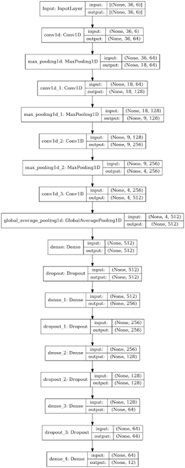
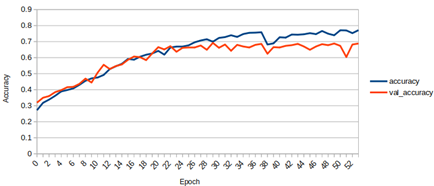

# ANNDL2022 Homework 2

## Introduction
This project tackles the problem of classifying time-series data using various neural network architectures. The provided dataset is heavily imbalanced and consists of several time-series, each containing 6 features and 36 time-steps, divided into 12 classes. We experimented with multiple preprocessing techniques and model architectures to optimize the performance of our classification model.

## Materials and Methods

### Dataset
The dataset consists of 2429 time-series, each containing 6 features over 36 time-steps, divided into 12 classes. To address class imbalance, we used class weighting during the computation of the loss value and applied StratifiedShuffleSplit for training.

### Data Preprocessing
- **StandardScaler**: Used to standardize features by removing the mean and scaling to unit variance.
- **MinMaxScaler**: Attempted but found ineffective due to the narrow range and varying mean values of features.
- **Windowing and Zero-padding**: Tried various window lengths and strides, but the best results were achieved without windowing.

### Model Architectures
We experimented with several neural network architectures:
- **LSTM and Bidirectional LSTM**
- **Transformer**
- **1D ResNet**
- **1D Convolutional Neural Network (CNN)**
- **2D CNN**

The 1D CNN consistently outperformed other models. Our final model consisted of four 1D convolutional layers followed by five dense layers, with dropout applied to all dense layers, as showed in the following image.
<p align="center">  <p/>

### Training
Our training was centered around the `variable_training.py` script, allowing customization of training parameters such as epochs, learning rates, loss functions, and class weights. The training process included:
- **One vs All Model**: Training 12 1D CNNs, each focusing on distinguishing one class from the rest.
- **1D CNN with StandardScaler**: Training on the full dataset and subsets of features.
- **2D CNN**: Converting time-series data into a 36x36x6 matrix.
- **Fourier Transform**: Changing the time series domain to the frequency domain before feeding into the network.

The final models and their performance are discussed in the results section.

## Results

The best performing model was the 1D CNN. Below is a summary of the models and their performance:

| Model                         | Training Accuracy (%)| Validation Accuracy (%)| Test1 Accuracy (%)| 
|-------------------------------|-------------------|---------------|---------------|
| 1D CNN                        | 83.48             | 70.10         | 70.46         |
| 2D CNN                        | 72.98             | 66.05         | 67.35         |
| 1D CNN with FFT               | 84.56             | 69.55         | 69.04         |
| 1D CNN with 5 features        | 89.81             | 69.14         | 67.95         |

We employed an ensemble method combining all available models, achieving a score of 74.50% in the final phase. This approach proved effective, reducing the classification error by approximately 4%.

The training of one of the 1D CNN models is reported in the graph below.

<p align="center">  <p/>

## Conclusion
The 1D CNN was the most effective model for our time-series classification task. Using an ensemble of models helped mitigate overfitting and improved classification accuracy. Future work could explore more sophisticated data augmentation techniques and further fine-tuning of model hyperparameters.


</br>
</br>

<details>
  <summary>Instructions</summary>

Our project has been developed with TensorFlow 2.4.1 and python 3.9.15pr

In a terminal execute:
```bash
git clone https://github.com/Davide-Console/AN2DL_2022_homework2.git
cd AN2DL_2022_homework2
```
## Networks
To visualize the architecture of our best model execute
```bash
python networks.py
```
## Prepare dataset
Before training, prepare the dataset executing:
```bash
python dataset_preparation.py
```
## Training
To perform training with time-series of 6 features (default):
```bash
python variable_training.py
```

To perform training with time-series of 5 features, without the most related one:
```bash
python variable_training.py -mod 5_features
```

To perform training with data augmentation:
```bash
python variable_training.py -mod data_aug
```

To perform training with 2D reshaped time-series:
```bash
python variable_training.py -mod 2d
```

To perform training with fft added features:
```bash
python variable_training.py -mod fft
```
#


---
GPU_MEMORY and execution_settings are utils scripts to perform training on a local GPU (RTX2060 Mobile and a GTX1050 Mobile)

</details>

### Authors: 
- Berzoini Raffaele
- Console Davide
- Manzo Noemi
